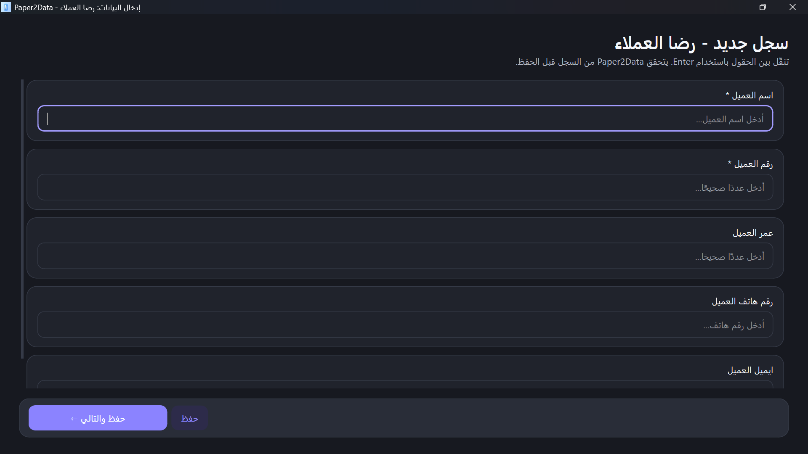
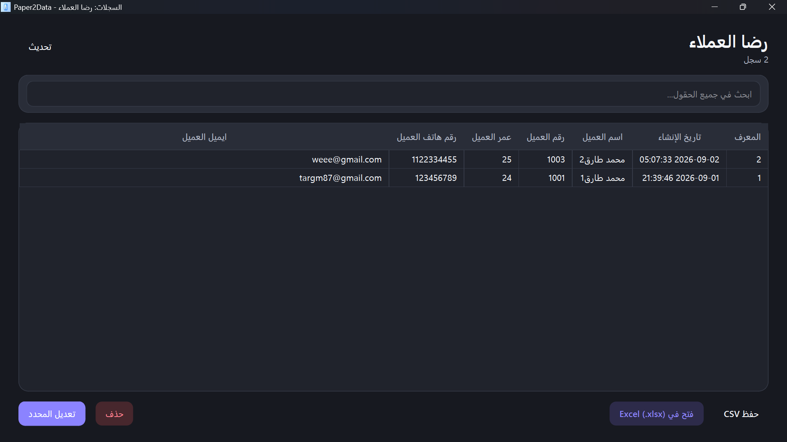

# Paper2Data

**Turn paper forms into clean, structured data — without living inside a spreadsheet.**

Paper2Data is an offline-first Windows desktop application designed for researchers, students, data-entry teams, offices, and organizations that need to digitize paper forms or surveys into structured **Excel (`.xlsx`)** and **CSV (`.csv`)** data.

> Paper → guided data entry → validated records → Excel / CSV


## Screenshots

| Projects Dashboard | Form Builder |
| --- | --- |
|  |  |

| Data Entry | Records & Export |
| --- | --- |
|  |  |

## Why Paper2Data?

Entering hundreds of paper questionnaires directly into Excel can be slow and error-prone, especially for users who are not comfortable with spreadsheets. Paper2Data replaces the raw grid with a purpose-built form-entry workflow:

- create a project;
- define fields by meaning rather than spreadsheet formatting;
- enter one record at a time;
- validate values before saving;
- review and search records;
- export clean data when the work is complete.

The current MVP is intentionally focused: **data entry and digitization, not statistical analysis**.

## Highlights

- **Offline-first** — project data is stored locally in SQLite.
- **No-code form building** — define fields without programming or database knowledge.
- **41 field types** — text, numbers, dates, choices, identifiers, location, measurements, files, barcodes, calculated/automatic fields, and more.
- **Typed validation** — required fields, numeric formats, email, phone, URL, IDs, dates, percentages, and other field-aware rules.
- **Smart Excel export** — numbers, dates, times, booleans, percentages, and text identifiers are mapped to appropriate Excel cell types.
- **CSV export** — canonical text output for interoperability.
- **Spreadsheet-injection protection** — user-entered text is prevented from becoming executable spreadsheet formulas during export.
- **Five interface languages** — Arabic, English, French, Russian, and Chinese.
- **RTL-aware** — Arabic uses right-to-left layout while phone numbers, URLs, codes, IDs, and numeric values remain readable left-to-right.
- **Light and dark themes** — a calm desktop UI designed for long data-entry sessions.
- **Keyboard-friendly data entry** — optimized for repetitive desktop entry workflows.
- **Automated quality gates** — unit, integration, security, E2E, GUI E2E, and performance tests.

## Current platform

The validated MVP is a **Windows desktop application** built with Python and PySide6. Mobile support remains part of the product roadmap, but is not included in this repository's current release candidate.

## Field type system

Paper2Data uses stable internal field IDs, independent from translated UI labels. This means changing the application language does not change how data is stored or exported.

Representative categories include:

| Category | Examples |
| --- | --- |
| Text | Short Text, Long Text, Address |
| Numeric | Integer, Decimal, Currency, Percentage |
| Date & time | Date, Time, Date & Time, Duration |
| Choices | Yes / No, Single Choice, Multiple Choice, Dropdown, Radio Buttons, Checkboxes |
| Contact | Phone Number, Email, URL |
| Identifiers | Identifier / ID, National ID, Code, Postal Code |
| Location | Country, State / Province, City, Latitude / Longitude |
| Measurement | Measurement, Weight, Length / Height, Temperature |
| Capture | File Attachment, Image, Signature, Barcode, QR Code |
| Automatic | Calculated Field, Auto Number |

Some advanced field types are represented in the type system before every advanced editor is fully implemented. See [Roadmap](docs/ROADMAP.md).

## Languages

| Language | Code | Direction |
| --- | --- | --- |
| Arabic | `ar` | RTL |
| English | `en` | LTR |
| French | `fr` | LTR |
| Russian | `ru` | LTR |
| Chinese | `zh` | LTR |

Translation source files (`.ts`) are version-controlled. Generated Qt `.qm` binaries are built locally or in CI.

## Getting started from source

### Requirements

- Windows 10/11
- Python **3.13** (the currently validated development runtime)
- Git

### Install

```powershell
py -3.13 -m venv .venv
.\.venv\Scripts\Activate.ps1
python -m pip install --upgrade pip
python -m pip install -r requirements.txt
python scripts\build_translations.py
python main.py
```

If your PowerShell execution policy prevents virtual-environment activation, you can call `.venv\Scripts\python.exe` directly instead of weakening system-wide security settings.

## Testing

Install test dependencies:

```powershell
python -m pip install -r requirements_test.txt
```

Common profiles:

```powershell
python scripts\run_tests.py quick
python scripts\run_tests.py unit
python scripts\run_tests.py integration
python scripts\run_tests.py security
python scripts\run_tests.py e2e
python scripts\run_tests.py gui
python scripts\run_tests.py performance
python scripts\run_tests.py full
```

The latest local Windows release gate completed with **124 tests passing** before packaging. Performance tests are separated so they can be run deliberately rather than slowing every development cycle.

See [Testing](docs/TESTING.md) for the test strategy and quality gates.

## Build the Windows application

Install release dependencies:

```powershell
python -m pip install -r requirements_release.txt
```

Build using the release script:

```powershell
powershell -ExecutionPolicy Bypass -File .\scripts\build_windows_release.ps1
```

The build is produced in `dist/Paper2Data/` and uses PyInstaller **onedir** packaging for the MVP.

### Windows Smart App Control / signing

Local unsigned builds may be blocked by Windows Smart App Control or an organization-managed App Control policy. This is a publisher-trust issue, not something Paper2Data should bypass. Public binary distribution should use an appropriate code-signing process.

Do **not** publish an `UNVERIFIED` binary archive as a final release.

See [Release Checklist](docs/RELEASE_CHECKLIST.md).

## Data location and privacy

During normal source development, the existing local development database stays in the project workflow for backward compatibility. A frozen Windows build stores writable application data under the user's local application-data directory, rather than next to the executable.

Paper2Data's current MVP is offline-first and does not require a cloud account. Users explicitly choose when to export records to Excel or CSV.

See [Privacy](docs/PRIVACY.md).

## Architecture

Paper2Data follows layered architecture and keeps UI, business rules, persistence, and infrastructure concerns separate:

```text
Paper2Data/
├── core/                  # database, export, localization, runtime services
├── data/                  # repository implementations
├── domain/                # entities, abstractions, validation/type services
├── presentation/          # views, viewmodels, reusable components, theme
├── scripts/               # translations, tests, release tooling
├── tests/                 # unit, integration, E2E, performance, security
├── release/               # PyInstaller release configuration
└── main.py                # application entry point
```

See [Architecture](docs/ARCHITECTURE.md) for details.

## Security

Security-oriented regression tests cover areas including:

- parameterized SQLite operations and SQL-injection attempts;
- spreadsheet formula injection in Excel/CSV exports;
- SQLite foreign-key integrity;
- accidental sensitive console output;
- raw dynamic execution such as unsafe `eval` / `exec` usage.

Please report suspected vulnerabilities privately. See [SECURITY.md](SECURITY.md).

## Repository status

Paper2Data is currently at the **v1.0.0 release-candidate stage**. The complete automated quality gate passes with **124 tests**, and the packaged Windows executable has passed local smoke testing. Public binary distribution is intentionally deferred until an appropriate code-signing process is in place.

## Roadmap

Near-term priorities include:

- project creation wizard;
- auto-save and resume;
- pre-export review;
- reusable project templates;
- undo/redo improvements;
- advanced search and filters;
- Excel import;
- richer per-field settings;
- a safe calculated-field formula engine;
- mobile client after desktop MVP stabilization.

OCR, cloud sync, and AI-assisted extraction remain intentionally outside the current MVP.

See the full [Roadmap](docs/ROADMAP.md).

## Contributing

Contributions are welcome. Please read [CONTRIBUTING.md](CONTRIBUTING.md) before opening a pull request.

The codebase prioritizes **SRP, DRY, KISS, YAGNI, clear naming, layered architecture, reusable components, and testable business logic**.

## License

Paper2Data is released under the [MIT License](LICENSE).

---

### Arabic documentation

لشرح عربي مختصر للمشروع وطريقة التشغيل: [README_AR.md](README_AR.md)
